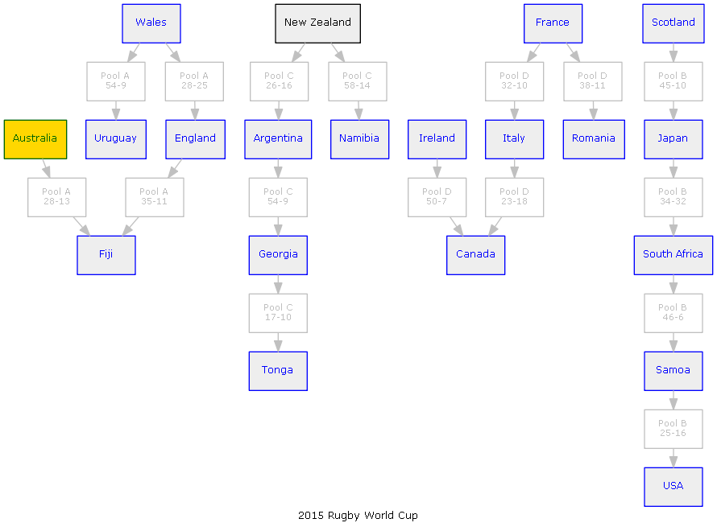

## graphviz-scores
Renders competition scores as a graph

A different way to summarize the games played between teams

### Example
Here is the output from the first 16 games of the Rugby World Cup

